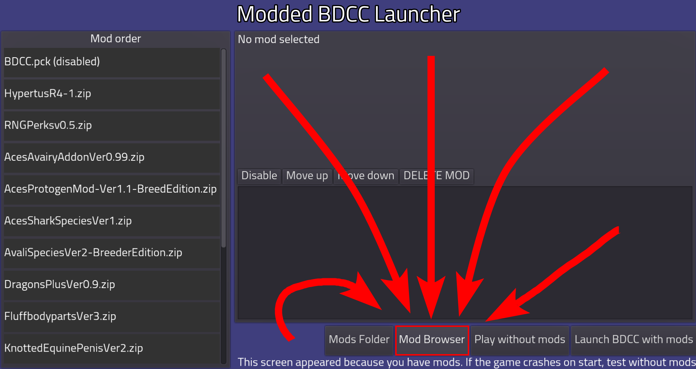
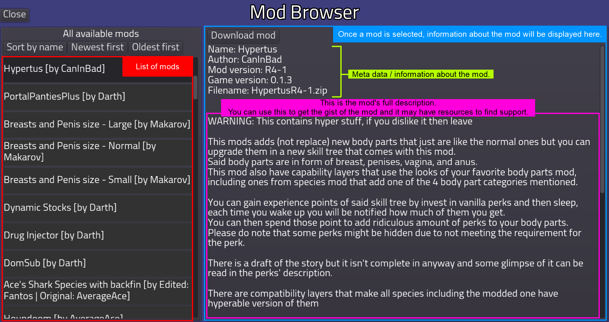
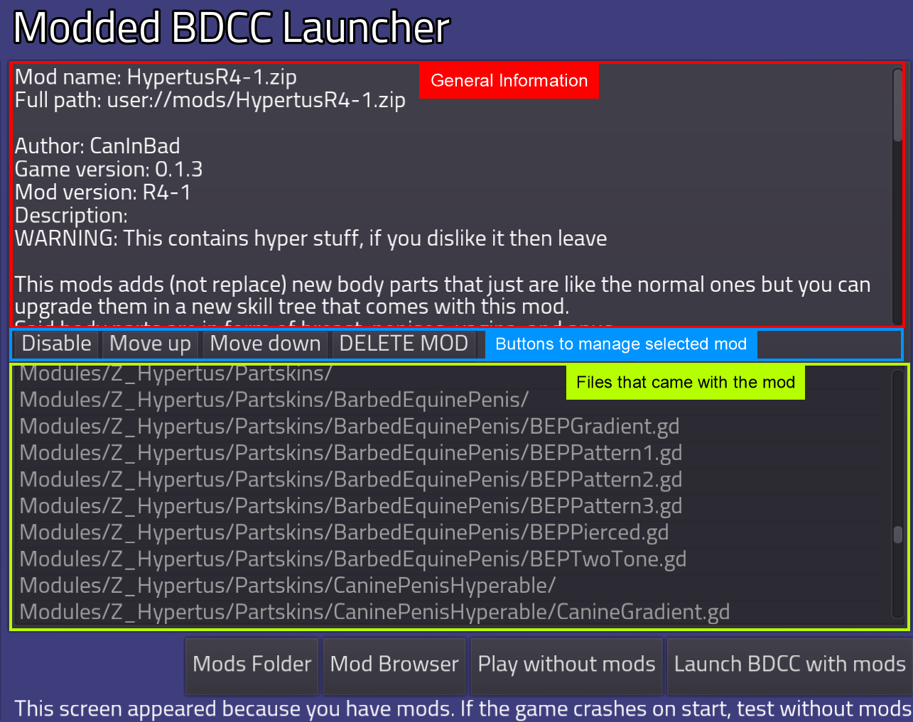

# Where (and how) to get mods

> [!IMPORTANT]
> Mods are simple zip archives. **Don't unpack them.**
>
> Keep in mind that some mods **NEED** to be updated for each new version of a game. If the game crashes on start, remove mods.

You can get them inside the game's discord  
[BDCC Discord Invite](https://discord.gg/7UGYBvQrc3)  

Though, you have to manually install it. How you install it will be covered in this
<!-- note to self, don't forget to link it when its finished -->

## Mod Browser

### Enabling BDCC Mod Launcher

If you already installed mods, [skip this section.](#inside-the-mod-launcher)

To enable BDCC Mod Launcher, you must at least reached title screen.  
1. Click Options.
2. Find and click the box next to "Enable Modded BDCC Launcher", Make sure that it's checked.
3. Save and close.
4. Quit Game.

Once you restart the game and you done everything correctly, a new screen will show up before loading.

### Inside the mod launcher

#### Downloading mods

Click the "Mod Browser" button

 

 

Inside the mod browser, on the left should be a list of mods. It is recommended to click "Newest first" to sort mods by date that its updated. Picking one of the mods will show its information on the right as well as a big "Download mod" button.  

> [!NOTE]
> 1. The mod browser will sorted the mod by newest first by default.   
> 2. You can scroll down in the mod's information if the description is long enough.
> 3. Don't forget to read the description.  
> 4. Download button is always on top of the metadata/information  

> [!WARNING]
> Some mods will show you what game version its compatible with.  
> It is not recommended to download and run mods that isn't compatible.
> On that note, few mods' description will tell you if it should be fine to run or not.

 

 

Once you click "Download" Mod, a dark transparent screen with text "Downloading..." will appear then quickly disappear <i>(or not depends on your internet connection speed)</i>  
If you wish to continue download more mods, select another and download them. Repeat this until you're satisfied

> [!CAUTION]
> Make sure to read the mod's description, some mods will conflict with each other. 

Once you finished downloading mod(s) you can then click "Close" on the top left of the screen

#### Managing installed mods

The mod launcher's interface should resemble the mods browser and this section will not explain how it works here. If you do not know how to use the mod browser, please [see previous section](#downloading-mods)

Once selected a mod, you should see that the information side is slightly changed.  
It now has 3 sections, The metadata / general information w/ description, buttons to manage the mod, and files that came with the mod in order from top to bottom.

 

 

This section will skip the general information.

> [!IMPORTANT]
> Some mods don't have a metadata packed with them and will display
> `No 'insertModFileNameHere.json' file provided inside the mod`.  
> This **DOESN'T HAVE ANY IMPACT ON ITS FUNCTIONALITY**.  
> If you're having trouble(s) playing the game with mod(s), please consult this page (not done)
<!-- Don't forget to link it here when finished troubleshooting page -->

There are 4 buttons to manage mods, they're pretty self explanatory but we'll cover what order of mods affect them.

You can get the gist on how large a mod is inside the last section.

#### Updating mods

NOT DONE

# Old Information

### Where to get mods
For now the only source of mods is the game's discord

[BDCC discord link](https://discord.gg/7UGYBvQrc3)

Mods are simple zip archives. Don't unpack them

Keep in mind that some mods NEED to be updated for each new version of a game. If the game crashes on start, remove mods

### Windows/linux/mac
1) Open the game
2) Press 'Mods'
3) Press 'Open mods folder' or go to `%appdata%/Godot/app_userdata/BDCC/mods` folder
4) Copy the zip files into that folder
5) Restart the game, mods should appear

### Android
1) Open the game
2) Press 'Mods'
3) If the game asks for external storage permissions, you gotta accept
4) Press 'Import mod' button. Game should tell you where to store mods on your device. It's usually the `documents/BDCCMods` folder
5) Copy `BDCC.pck` file into that folder. Warning. You will need to update this file with the new ones after each game update or stuff will crash
6) Copy the zip files into that folder
7) Restart the game. There should be a BDCC.pck file loaded as mod and you should also see other mods

If you don't do Step 5 the game will crash! Limitation of godot engine. `BDCC.pck` file can be downloaded separately from itch/github releases

### HTML5
1) Open the game
2) Press 'Mods'
3) Press 'Import mod'. Select the zip file
4) Reload the page. Mod should show up

Be very careful with mods and HTML5 version. If the mod crashes the game, your only option is to clear your localstorage. That will also delete your saves!