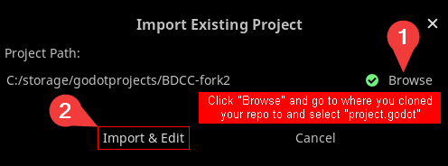

# Setting up development environment

<details>
<summary>Table of contents</summary>

|  Section  | Link |
| --- | --- |
| Basic information | [Link](#basic-information) |
| Guides | [Link](#guides) |
| Purist | [Link](#godot-editor-purist) |
| VSCodium | [Link](#github-fork---git-clone---vscode-ium) |

</details>

## Basic information

BDCC is running on Godot version 3.X, but recommended version to build mods on is 3.5.3  
You can get the [Godot Editor 3.5.3 here.](https://godotengine.org/download/archive/3.5.3-stable/) You will have to add Godot Editor to PATH environment if you want to follow some of the guides

> [!IMPORTANT] Do not get the mono version
> .NET or mono version is a separate binaray that support C#, **BDCC isn't built on mono**

As stated in the home page, we cannot migrate to Godot 4 directly without undergoing rewriting, feel free to make the migration yourself.

You can setup dev environment in multiple ways. This guide will attempt to provide instructions in those different ways, some are better than another so pick wisely.

**It isn't recommended to use and build mods on Android or web editor. <mark>Just because they exist, didn't mean that they work great.</mark>**

## (Optional) Adding Godot to PATH 

for skipping this section, [Click me](#guides)

> [!IMPORTANT]
> THIS IS WINDOWS ONLY, for unix equaliance please see your documentation on bash profile

This will assume that you already have Godot Editor inside your system and not yet add it it PATH

Press the start menu and type `system environment variables`, select the first option

<div align="center">
   <br/>
   <sup>System Environment Variables.</sup>
</div>

Press "Environment Variables"

<div align="center">
   <br/>
   <sup>One step closer to actually editing system environment variables.</sup>
</div>

Select `PATH` in user variables and click "Edit"

<div align="center">
   <br/>
   <!-- <sup>System Environment Variables.</sup> -->
</div>

Click "New" then there should be an empty box below all the paths in the table, put the location where you put your godot editor to it.

<div align="center">
   <br/>
   <!-- <sup>System Environment Variables.</sup> -->
</div>

Congratz, you just add godot in your path! try by typing `where godot` in new cmd sessions

# Guides

## Godot Editor Purist

This is a typical way people set up their first Godot project to use.

### Requirements

- Godot Editor

### Setting up

You can download the whole project as a [ZIP](http://github.com/Alexofp/BDCC/zipball/main/) or use [git to clone it](https://docs.github.com/en/repositories/creating-and-managing-repositories/cloning-a-repository), put the project somewhere.

### Open the project in Godot Editor

Open your Godot Editor, if you haven't import the project; on first launch there won't be any items in this screen. Press Import,

<div align="center">
   <br/>
   <sup>Import button</sup>
</div>

If you download the zip, click Browse, select the zip, then another text box will appear after you select Open, click Browse on the one next to new textbox, go to where you would like to put the project in. The location of the new project must be an empty folder. After you decided where you are going to put your project, click Select Current Folder.  
You can then click Import & Edit

<div align="center">
   <br/>
   <sup>Importing Zip Dialog with everything completed as described above</sup>
</div>

If you cloned the project with git, the process will differ slightly.  
Click Browse, go to where you cloned the project, select `project.godot` file then open. You then click Import & Edit.

<div align="center">
   <br/>
   <sup>Importing the cloned project</sup>
</div>

If you just did previous step or already imported the project, all projects you imported will live on the godot editor's "main menu" screen.  
Simply double click the project you want to edit.

Congratz, you just open the project in editor. Go wild.  
To test run the game, either press F5 or press the "Play" button on top right. This will launch a debugging session.

You are now ready to start modding the game. Go back to [Home page](Home) for quick links to documentation on how to adding certain features in the game

## GitHub fork - git clone - VSCode(-ium)

This is a highly recommended to use this method as it's the most complete setup to build on with version control and easy version controlling. The only downside is it take too much RAM when running with the godot editor

### Requirements

- Godot Editor <sub>Mainly for language server and debugging</sub>
- GitHub account
- Git  
  - If you don't have git installed and setup, [please do so.](https://docs.github.com/en/get-started/getting-started-with-git/set-up-git#setting-up-git)
- [VSCode](https://code.visualstudio.com/Download) (or [VSCodium](https://vscodium.com/) if you prefer) installed  
  - Please also get Godot-tools plugin either with [these instructions](https://github.com/godotengine/godot-vscode-plugin#download) or inside "Extensions" tab.

### Setting up

#### Creating a fork

Simply go to [the homepage of this repo](https://github.com/Alexofp/BDCC/) and click Fork, it should be on the top right of the page.

<div align="center">
   

   <sup>Cursor on the fork button.</sup>
</div>

If you are signed-in, it will lead you to this screen. You can change things before creating a fork. After you finished, click "Create Fork".

<div align="center">
   

   <sup>Fork creation screen</sup>
</div>

#### Cloning your fork

This assumes that you already have your git installed and configured as stated in requirement, if not [please see this guide.](https://docs.github.com/en/get-started/getting-started-with-git/set-up-git)

Open your VSCode and click "Clone Repositoy", there will be a bar appear on top of the window asking you to put in URL to clone. Put in your repository's git url, it would look like this: `https://github.com/{YourUsername}/{YourRepoName}.git`

<div align="center">
   

   <sup>Cloning Repository</sup>
</div>

After hitting enter, it will either prompt you to login to your GitHub account or ask where do you want to place the repository at.  
If the former then please do so, then VSCode will automatically open that folder for you and proceed to next step (same goes to the latter)

#### Opening Godot editor with the project.

Assuming that you installed the extension provided above, go to the extension's settings by clicking the Extensions tab, then look for cog icon on the extension and press "Extension Settings"

<div align="center">
   <br/>
   <sup>Extension settings</sup>
</div>

Change `Editor Path: Godot3` to either just `godot` if you already did [set godot engine to path](#optional-adding-godot-to-path)  
or full path if you haven't, copy paste full path to the executable file.

Close the settings tab and press Ctrl + Shift + P to open command palette, then type `> open workspace with godot editor`, press enter and it should open godot editor inside the repository.

You can then make changes and add contents. For quick links on adding contents to the game please see [home page](Home)

### Running debug session with VSCode

If you aren't planning to add [submodules](https://git-scm.com/book/en/v2/Git-Tools-Submodules) to the project, you can just press F5 in current configuration to start a debugging session attached to VSCode; even if there is no editor running (as the editor is only surving as [language server](https://en.wikipedia.org/wiki/Language_Server_Protocol) in this configuration)

If you are going to use submodules in the future, You have to create default run and debug profile. for quick configuration you can use my profile, put this in `.vscode/launch.json`

```json
{
    "version": "0.2.0",
    "configurations": [
        {
            "name": "GDScript Godot",
            "type": "godot",
            "request": "launch",
            "project": "${workspaceFolder}",
            "port": 6007,
            "address": "127.0.0.1",
        }
    ]
}
```

This will mark opened workspace folder as root for godot debug session to launch in.

For more documentation on this specific topic please see [Godot Tools' documentation on GDScript Debugger](https://github.com/godotengine/godot-vscode-plugin/blob/master/README.md#gdscript-debugger)

### Making changes and upload it to github

After you made your changes and you want it on GitHub then please look at the Source Control, commit your changes and sync. For more information regarding using this feature [please see this page.](https://code.visualstudio.com/docs/sourcecontrol/overview)