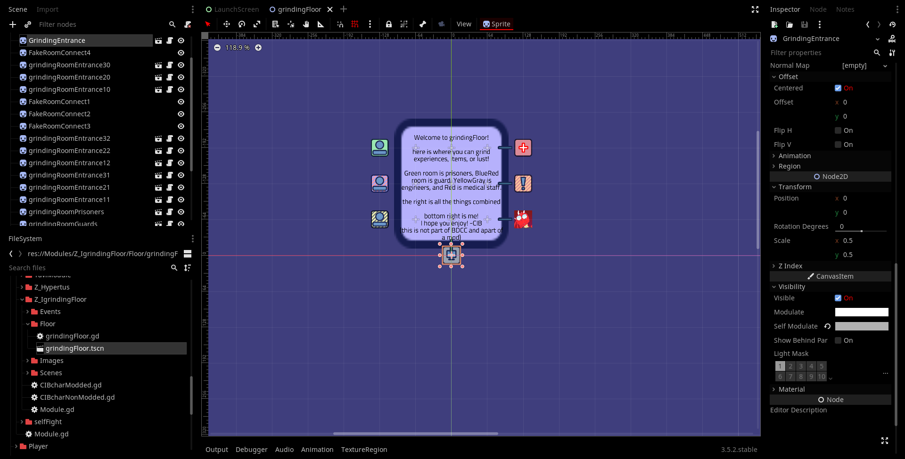
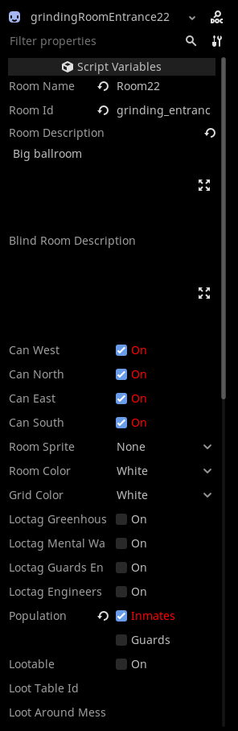
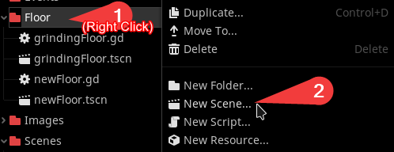
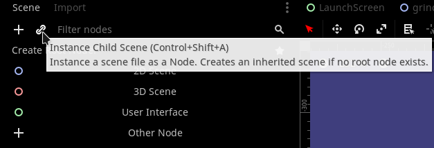
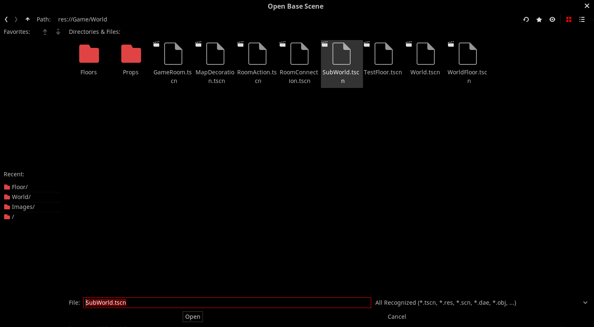
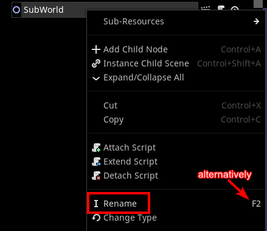
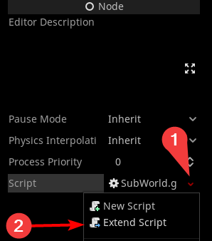
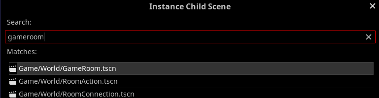
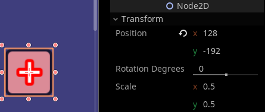

# Floors Basics

Floors can be registered by putting the script and scene file in `res://Game/World/Floors`, the ID will be whatever the file name is without the extension.  
Or it can be registered with a module calling a method `registerMapFloor(id:string, path:string)` in `GlobalRegistry`

If the ID existed already, it will replace the floor entirely with new one.  
Registering new floor requires scene file (will go into detail next section)  
[For example:](https://github.com/CanInBad/grindingFloor/blob/d5c395d65413a8da80c5d1e37ec61e0e4566198f/Module.gd#L24)
```gdscript
GlobalRegistry.registerMapFloor("grindingFloor","res://Modules/Z_IgrindingFloor/Floor/grindingFloor.tscn")
```
This will register a floor with ID "grindingFloor" with the path `res://Modules/Z_IgrindingFloor/Floor/grindingFloor.tscn`

# Floor & Room Anatomy
<sup>aka scene file</sup>

A floor is essentially 2 files, the scripting part and the floor layout (or scene part).  
The scripting part is optional but this article will include it.  
It is recommended to include scripting, you will thank me later.

Inside the scene file, a floor is essentially a Node2D which instanced `res://Game/World/SubWorld.tscn` (will go into detail how to create such)

Each floor is consist of rooms in 64 unit grids in both X and Y axis, if they're unaligned, on runtime it will automatically snap to nearest point in a grid\*

*\* its not exactly nearest point, please check [these lines](https://github.com/Alexofp/BDCC/blob/58885806c1bb8254ce250a56a08d241d5a106623/Game/World/World.gd#L169-L170)*


<center><sup>Editor showcasing a floor with grid turned on, added to make this article prettier :+1:</sup></center>  

A room is Node2D which instanced `res://Game/World/GameRoom.tscn` (will go into detail how to create such)

Each room must be assigned to **unique** ID, if 2 rooms have the same ID, whichever load last get rejected, this also applies to other floors. This means that if you have a room that have the same ID as the other, the room that load last will disappear or crash the game entirely  
(as of 2024-05-16 - I, CanInBad, didn't check if crashes or not)

A room can be configured a lot to do a lot of things, below image is an example
<center></center>  
<center><sup>A image showing properties in a room</sup></center>

Here are notable properties

1. Room Name
   * This is used to display room's name on the top of the floor preview on runtime  
   Can be repeated with other rooms'
2. Room Id
   * :warning: This is required and must not be repeated.
3. Room Description
   * This is for showing message when you're in a room. The message will appear on the text log.
4. Can X
   * If the direction is off, any room that connected in that direction will not be walkable, This will also affect path finding for scene using them.
5. Room Sprite & Color
   * Changes room's appearance on presets, experiment and see what they does.
6. Grid Color
   * Changes striped color across the room, if its on white the stripe will be invisible.
7. Loctags
   * Changes which type(s) of guards spawns in the room. *I haven't check if having multiple of them does anything.*
8. Population
   * Changes which type of NPC to spawn. Please note that nurses, guards, and engineers are grouped as Guards
9. Lootable and its settings
   * Table Id
     * Which loot table to use when looting.  
       *At the time of writing, I haven't experiment with this yet -CIB* 
   * Around Message
     * What message to display when the room is lootable
   * Credits
     * How much credit do player get once looting
   * Every X Days
     * When does the loot get refills. If not specified, it will never get refilled.  
  
It is recommended that you do not use Lootable properties, using events will give you more flexibility.


# Making a floor

## Root floor

First step is to create a new scene file. It can be in the folder we discuss in [Floors Basics](#floors-basics) but this guide will follow registering the floor with module.  
(if you don't know anything about module, you can learn [about it here](What-are-modules.md))

Right click on FileSystem window, it can be any folder or even a file and click "New Scene..."  
You can name it whatever, the file extension will be `.tscn`.

<center></center>  
<center><sup>A image showing steps to create new scene</sup></center>

Next, Click the chain link icon in the scene tab

<center></center>  
<center><sup>A image showing mouse cursor hovering over the icon with text &#34;Instance Child Scene&#34;</sup></center>

You then have to navigate yourself to `res://Game/World`, select `SubWorld.tscn`, and open it 

<center></center>  
<center><sup>A image showing a window title &#34;Open Base Scene&#34; while selecting &#34;SubWorld.tscn&#34; in its file explorer</sup></center>

After opening, you will see a item/Node2D in Scene tab.  
You can rename it whatever but ideally I recommend name it to the ID you're going to use, mine is going to be "helloWorld".  
*Please note that this Node2D is a root of a floor, without it a floor doesn't exist*

<center></center>  
<center><sup>Renaming a node by right click on it and click &#34;Rename&#34;, or hit F2</sup></center>

Adding scripting is easy as selecting the Node2D and click arrow drop down menu then click Extend Script, it is recommended to keep them together in the same folder as the floor scene file.  
A script can do things that events could but bundled with the floor itself.  
*(There will be demo later after we finish making rooms)*

<center></center>  
<center><sup>Image showing steps to extend script</sup></center>

## Rooms

After creating floor root node, we'll be covering how to make rooms

Firstly, click the root node to select, then click the chain icon again to add another PackedScene, then search for "GameRoom". Select the one that says `Game/World/GameRoom.tscn`

<center></center>  
<center><sup>Image showing a dialog box with text &#34;GameRoom&#34;</sup></center>


<br />
<br />
<br />
<!-- draft for later, i accidently typed this out first -->

It is recommended to have the scale of each room to be 0.5 on both axes, since vanilla game's rooms all have 0.5

<center></center>  
<center><sup>A image showing Node2D size</sup></center>