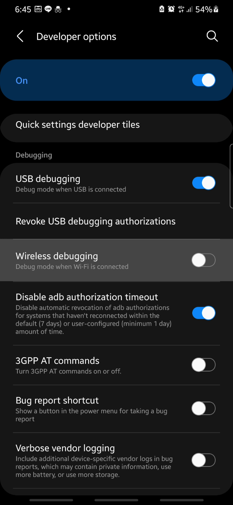
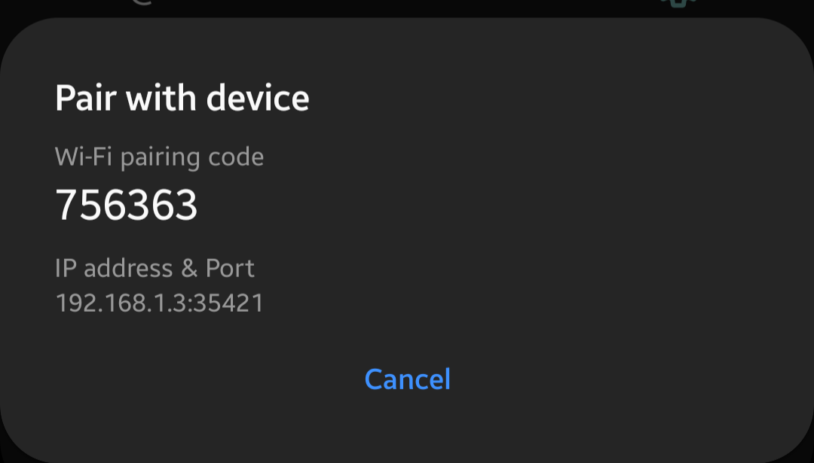

This page is for **Android 13 and up**, the reason being [Android 13 changes how app get access with storage](https://developer.android.com/about/versions/13/behavior-changes-13#granular-media-permissions)

For saves:  
Update 0.1.2 tried to mitigate importing process by using the BDCCSaves inside Documents folder for pesudo-importing save but the game itself still store saves inside its internal storage that normal file managers have **NO access** to where the saves are (unless exclusively given the permission).

This page is here to help **return the functionality of import and export button** in the game's load menu.  

This required a phone that isn't restricted the developer options (mainly Xiaomi phones)

For mods:

While mods are [saved externally](https://github.com/Alexofp/BDCC/blob/58885806c1bb8254ce250a56a08d241d5a106623/GlobalRegistry.gd#L94-L103), [the importing process](How-to-install-BDCC-mods#import-in-mods-menu-at-title-screen-3) inside the game still requires now defunct `READ_EXTERNAL_STORAGE` permission.

This page is aimed to return the functionality of importing mod by granting those defunct permission manually.

## PC required option

If you only have your mobile phone, please skip to [next section](#termux)

### Requirements

* Computer with a USB port
* USB cable with data channel for connecting your phone to your computer

### 1) Installing ADB

If you have already installed ADB, skip to next section.

#### Windows

1. [You can get ADB from here (click me)](https://developer.android.com/tools/releases/platform-tools), After you download it you might want to keep it some where you can navigate using CMD or your terminal emulator of choice.

2. You can get ADB from WinGet, a package manager for windows. Using it by typing  
   ```bat
   winget install --id Google.PlatformTools
   ```  
   Then enter, it will prompt you to agree to both winget AND Google's ToS or ToU

#### Linux

> Please note that I personally don't use linux (lame I know) so this section just provided as some way you can get ADB.

| Distro | Command |
| ----------- | ----------- |
| Ubuntu | `apt get adb` |
| Fedora | `dnf install android-tools` |
| Arch | `pacman -S android-tools` |

#### MacOS

[I don't have any apple products in my house so this will do for now](https://www.xda-developers.com/install-adb-windows-macos-linux/#how-to-set-up-adb-on-macos)

### 2) Connect your phone to your computer

Connect your USB cable to your computer, make sure your computer detects your phone or the other way around.

### 3) Enable Debugging mode

If you haven't enabled it yet, you can go to your settings app > About Phone (or your equivalence) > Software information > Tap "Build Number" 7 times. If you don't understand this text then here is a [Video tutorial](https://youtu.be/3GBrEczOnOk&t=67)  
You will see a toast pop up saying "You are now a developer!"

After enabling debugging mode, go to Developer options, find USB debugging and enable it. Your computer will re-recognize your phone.

### 4) Granting BDCC to read and write "external storage"


The external storage in this context means anything beside its internal, just for that app, storage.

1) Open your terminal emulator of choice and <mark>navigate to where ADB is located</mark>

> [!NOTE]
> if you installed via package manager, there is a high chance that your ADB is already in PATH already so you can skip number 1)

2) Check if ADB can see the device by typing `adb devices -l` <br/>This will prompt your phone/device to allow debugging from you computer
3) Press Allow on your phone
4) Go back to your computer and type then enter  
   ```shell
   adb shell pm grant org.rahimew.bdcc android.permission.WRITE_EXTERNAL_STORAGE
   ```  
   and  
   ```shell
   adb shell pm grant org.rahimew.bdcc android.permission.READ_EXTERNAL_STORAGE
   ```

Go back and check if you can tap import/export save and mods.  
If no, you can ask for help in [modding-help at the game's discord](https://discord.gg/7UGYBvQrc3)
<br />
<br />

## Termux

> [!NOTE]
> It is recommend to use the [pc required option](#pc-required-option) rather than termux since it would be easier.

### Requirements

* Android that doesn't restrict being a developer.
* Connected to trusted network (Wi-Fi)
* [Termux](#0-install-termux)

### 0) Install Termux

Either get it from the Google Playstore or F-Droid

| Google play | F-Droid |
| --- | --- |
| [Link](https://play.google.com/store/apps/details?id=com.termux) | [Link](https://f-droid.org/packages/com.termux/) |

### 1) Getting ADB in Termux

Open the app and type in

1) ```shell
   pkg update
   ```  
2) ```sh
   pkg install android-tools
   ```

You should be able to use `adb` now, try typing `adb start-server` and enter to start the server. If there is nothing error out then it should be fine to go to next step

if not then you'll have to follow [this repository for guide on how to install ADB from external sources](https://github.com/nohajc/termux-adb/blob/master/README.md#installation)  
After installation you should be able to start server again. if all else fail just get a computer and do [computer required option.](#pc-required-option)

### 2) Enable Debugging mode

If you haven't enabled it yet, you can go to your settings app > About Phone (or your equivalence) > Software information > Tap "Build Number" 7 times. If you don't understand this text then here is a [Video tutorial](https://youtu.be/3GBrEczOnOk&t=67)  
You will see a toast pop up saying "You are now a developer!"

### 3) Pairing Termux's ADB with your device's wireless debugging

You have to enable wireless debugging first, go to Developer options and scroll down to Wireless debugging. You are required to follow the [Requirements.](#requirements-1)

<div align="center">

 
</div>
<br />

If your device allows split-screen view or floating window of your apps, then you should make use of it in this step.

In Wireless Debugging menu, hit "Pair device with pairing code", You will have a pop-up showing your *1)* **pairing code**, *2)* **local IP**, and *3)* **a port** to be used in pairing process.
Make the settings app a floating windows or split-screen.  
This is required because if you close or freeze the settings app, the pairing process will be canceled. 

<div align="center">

 
</div>

> [!IMPORTANT]
> **DO NOT USE THE PORT FROM PREVIOUS SCREEN**, ONLY USE ONE <mark>FROM THE POPUP</mark>

Go back to Termux and type in `adb pair <ip>:<port> <code>`.  
Substitute the `<ip>` with IP address, `<port>` with port (numbers after semi colon), and `<code>` with the WiFi pairing code.

If you done everything correctly then the terminal will output `Successfully paired to <ip>:<port> [guid=<ID>]`

### 4) Connecting Termux's ADB with your device's wireless debugging

Go back to Wirelss Debugging menu. Inside should display both IP and port for connection. Either remember them or open settings app as floating window/split-screen.

In Termux, type in `adb connect <ip>:<port>`.  
Substitute the `<ip>` with IP address, and `<port>` with port (numbers after semi colon).

If the terminal split out something along the line of "Successfully connected" then it just connected.

Else you can check if you're already connected in next step.

### 5) Checking if you're connected to your device

In Termux, type in `adb devices -l` and it will list connected device with the bridge and well and its model.

If its an empty list then you aren't connected to any devices.

### 6) Granting BDCC to read and write "external storage"

The external storage in this context means anything beside its internal, just for that app, storage.

Type then enter  
```sh
adb shell pm grant org.rahimew.bdcc android.permission.WRITE_EXTERNAL_STORAGE
```  
and  
```sh
adb shell pm grant org.rahimew.bdcc android.permission.READ_EXTERNAL_STORAGE
```

Go back and check if you can tap import/export save and mods.  
If no, you can ask for help in [modding-help at the game's discord](https://discord.gg/7UGYBvQrc3)